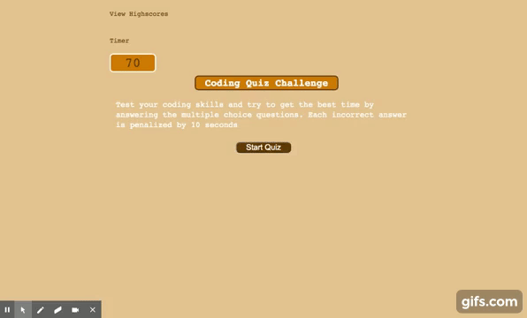

# Code-Quiz

## User Story
Making a Code Quiz to learn more about the functionality of javascript with timers, local storage, and web APIs

## Acceptance Criteria

- [x] I click the start button a timer starts and I am presented with a question
- [x] I answer a question, I am presented with another question
- [x] I answer a question incorrectly time is subtracted from the clock
- [x] all questions are answered or the timer reaches 0, the game is over
- [x] the game is over I can save my initials and my score

[Screencast](https://youtu.be/4lRAxtu9PG8)

[Deployed Link](https://gregpetropoulos.github.io/Code-Quiz/)